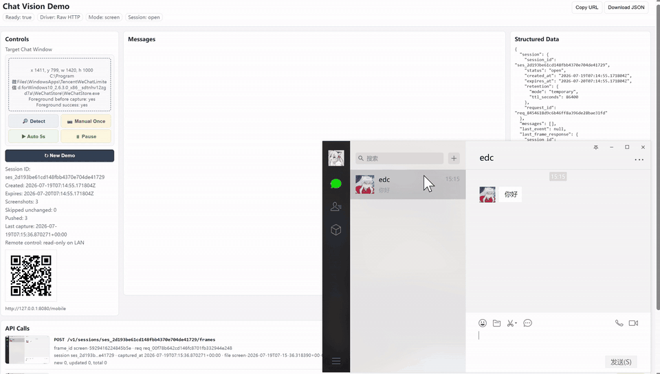
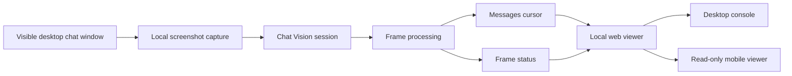

# Chat Vision Demo

## What Is This?

Chat Vision Demo demonstrates a screenshot-to-session workflow for Agent/RPA developers. It pushes desktop chat window screenshots to a Chat Vision API session, then displays reconstructed messages, frame status, and API calls in a local web viewer.



[Watch the 26-second accelerated MP4 demo](assets/demo.mp4)

Use cases:

- Agent/RPA visual state parsing
- desktop chat screenshot structuring
- multi-frame conversation reconstruction
- local demo viewer for chat UI parsing APIs

## Workflow



Boundary statement: **No hook. No injection. No protocol reverse engineering. No database reading. No auto-send.**

This repository is not the parsing kernel, not a product SDK, and not a client automation framework. It is a local operator-driven Windows demo harness that captures a visible desktop chat window, pushes changed screenshots to a deployed Chat Vision API endpoint, polls frame/message status, and serves:

- desktop control console: `http://127.0.0.1:8080/`
- optional phone read-only messages page when explicitly bound for LAN access

The API key stays in the local Python process. It is not returned to the browser, embedded in JavaScript, included in JSON downloads, or placed in the QR code.

The demo defaults to the raw HTTP driver and can also run through `chat-vision-sdk==0.1.0` with `CHAT_VISION_DRIVER=sdk` or `--driver sdk`.

See `KNOWN_LIMITATIONS.md` before running this outside a local development machine.

## Get API Access

This demo includes a temporary evaluation API key in `.env.example`. For production use, higher quota, SDK early access, or integration feedback, open a GitHub issue:

```text
https://github.com/xuyuanquant/chat-vision-demo/issues
```

## Install

For real desktop window detection and screenshot capture, run the demo from **Windows PowerShell**. WSL/Linux can run tests and serve the web UI, but it cannot capture a normal Windows desktop chat window for this demo.

```bash
cd chat-vision-demo
python3 -m venv .venv
. .venv/bin/activate
pip install -e '.[dev,windows]'
cp .env.example .env
```

The example environment file includes the demo API endpoint, demo key, and default Windows chat process. Adjust `.env` only if you need a different key, bind address, LAN public URL, or target process.

## Run On Windows

Recommended one-command recording/demo startup:

```powershell
cd C:\path\to\chat-vision-demo
powershell -ExecutionPolicy Bypass -File .\scripts\start-recording-demo.ps1
```

The recording script copies `.env.example` to `.env` when needed, starts from Windows Python, skips `git pull`, and enables foreground-window capture.

Manual startup:

```powershell
cd C:\path\to\chat-vision-demo
Copy-Item .env.example .env
powershell -ExecutionPolicy Bypass -File .\scripts\start-windows-demo.ps1 -ForegroundWindow
```

The script runs on Windows, creates/reuses `.venv`, installs dependencies unless `-NoInstall` is used, starts the demo on `127.0.0.1` by default, and writes logs:

```text
logs\chat-vision-demo-YYYYMMDD-HHMMSS.out.log
logs\chat-vision-demo-YYYYMMDD-HHMMSS.err.log
logs\chat-vision-demo-YYYYMMDD-HHMMSS.meta.txt
```

Stop it with:

```powershell
powershell -ExecutionPolicy Bypass -File .\scripts\stop-windows-demo.ps1
```

## Demo Flow

1. Open `http://127.0.0.1:8080/` on the computer.
2. Click `Detect` to locate the target chat window.
3. Click `New Demo` to create a fresh cloud session.
4. Click `Auto 5s` for continuous capture, or `Manual Once` for one push.
5. For LAN viewing, explicitly start with `-Bind 0.0.0.0` and a trusted LAN `-PublicUrl`, then open the read-only `/mobile` message view.

Example LAN mode:

```powershell
powershell -ExecutionPolicy Bypass -File .\scripts\start-windows-demo.ps1 -ForegroundWindow -Bind 0.0.0.0 -PublicUrl http://192.168.1.23:8080
```

`New Demo` deletes any previous cloud session, clears local messages/frames/counters/temp screenshots, and creates a new open session.

The phone page is read-only by default. Do not expose this demo to the public internet or configure router port forwarding. Binding to `0.0.0.0` makes the local service reachable from other machines on the network.

## Desktop Chat Window Capture

The demo detects supported desktop chat windows, filters hidden helper windows, uses DPI-aware Win32 coordinates, and temporarily places the target window topmost while capturing. It does not hook the chat application, inspect process memory, click, scroll, send messages, read local databases, or automate platform behavior.

## API Contract

The actual OpenAPI was read from:

```text
https://chat.trendflowing.com/openapi.json
```

A copy is stored at `openapi/openapi.json`.

Important deployed paths:

- `GET /ready`
- `POST /v1/sessions`
- `POST /v1/sessions/{session_id}/frames`
- `GET /v1/sessions/{session_id}/frames/{frame_id}`
- `GET /v1/sessions/{session_id}/messages`
- `DELETE /v1/sessions/{session_id}`

The desktop Viewer shows `API Calls` with screenshot thumbnails, request params, status, request id, and frame summary. Messages are read through the cursor-based `/messages` endpoint.

## SDK Mode

The demo supports an SDK driver backed by `chat-vision-sdk==0.1.0`. The Windows install extra includes the SDK package:

```bash
pip install -e '.[windows]'
```

Enable SDK mode in `.env`:

```text
CHAT_VISION_DRIVER=sdk
```

Or pass it on the command line:

```powershell
powershell -ExecutionPolicy Bypass -File .\scripts\start-windows-demo.ps1 -Driver sdk -ForegroundWindow
```

For recording/demo startup:

```powershell
powershell -ExecutionPolicy Bypass -File .\scripts\start-recording-demo.ps1 -Driver sdk
```

The SDK driver uses the same local viewer, capture loop, session lifecycle, frame polling, and messages cursor UI as the raw HTTP driver.

## Tests

```bash
pytest
```

Real cloud smoke test is opt-in because it consumes quota:

```bash
CHAT_VISION_API_KEY=... python -m chat_vision_demo.smoke --images C:\path\to\sanitized\screenshots --delete
```

The smoke test checks `/ready`, creates a session, uploads two images, waits for frame terminal status, reads messages with cursor, closes, and optionally deletes.

## FAQ

### Does this hook or automate WeChat?

No. The demo only captures a visible desktop chat window screenshot selected by the local operator. It does not hook, inject, reverse engineer protocols, read local databases, click, scroll, or send messages.

### Can I run the demo from WSL or Linux?

You can run tests and inspect the web UI from WSL/Linux, but real desktop chat window detection and screenshot capture must run from Windows PowerShell. Use `scripts/start-recording-demo.ps1` or `scripts/start-windows-demo.ps1` for the actual demo flow.

### Is the API key exposed to the browser?

No. The API key stays in the local Python process. Browser state only receives whether a key is configured and a masked hint, such as `847c...4f38`.

### Is this production-ready automation?

No. This repository is a demo harness for validating the screenshot-to-session API workflow. It does not include production authentication, monitoring, persistence, queueing, retry policy, or operational hardening.

### Where is the SDK?

The Python SDK package is `chat-vision-sdk==0.1.0`. This demo can run through it with `CHAT_VISION_DRIVER=sdk` or `--driver sdk`.

### Can I use my own screenshots instead of live desktop capture?

For cloud validation, use the opt-in smoke test with sanitized screenshots:

```bash
CHAT_VISION_API_KEY=... python -m chat_vision_demo.smoke --images C:\path\to\sanitized\screenshots --delete
```
